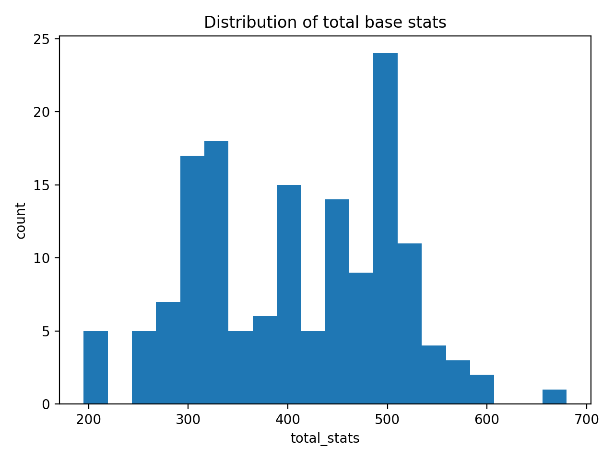
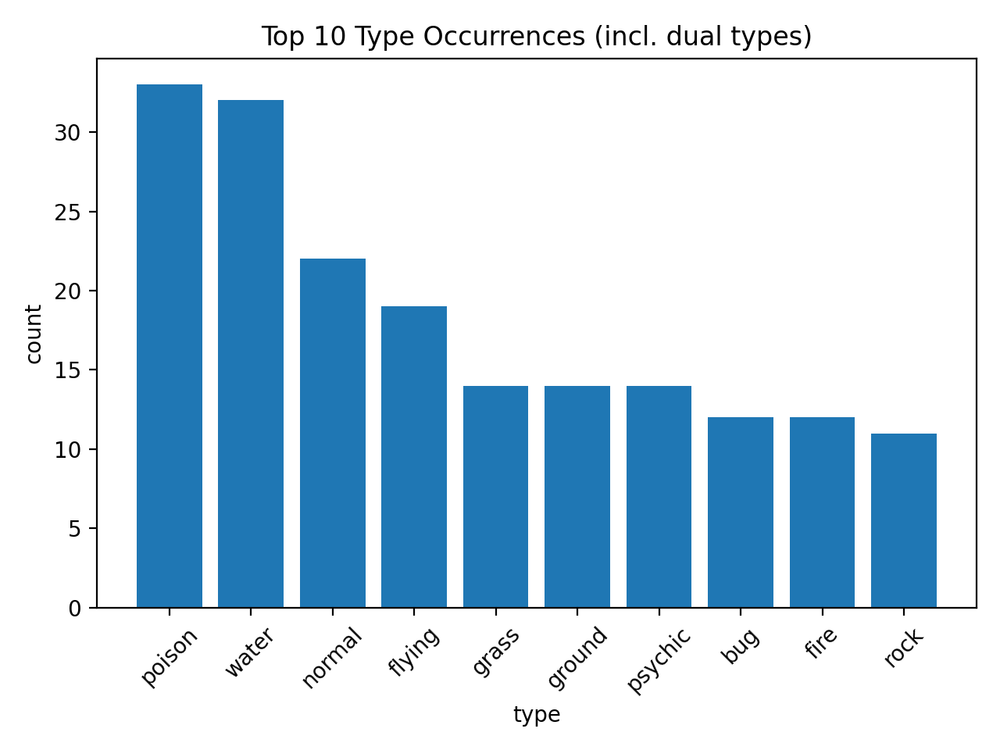
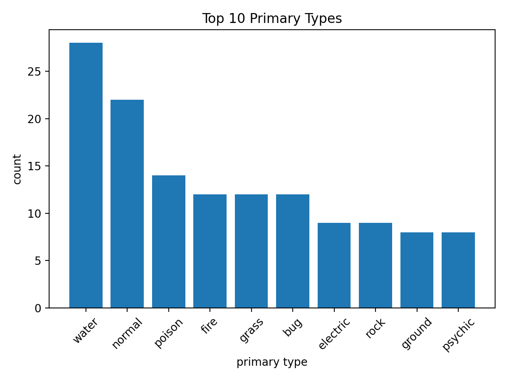
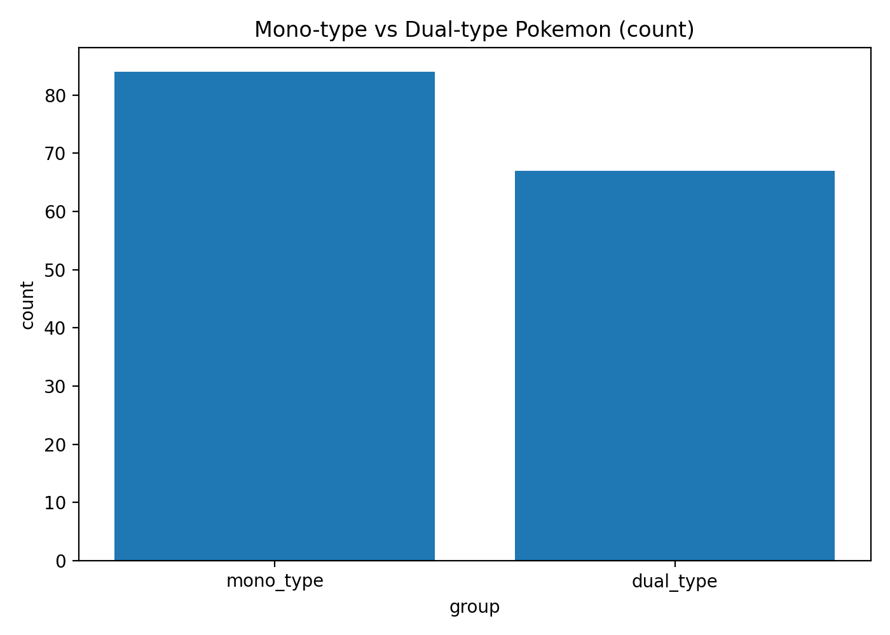
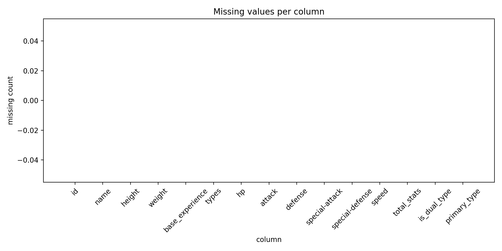
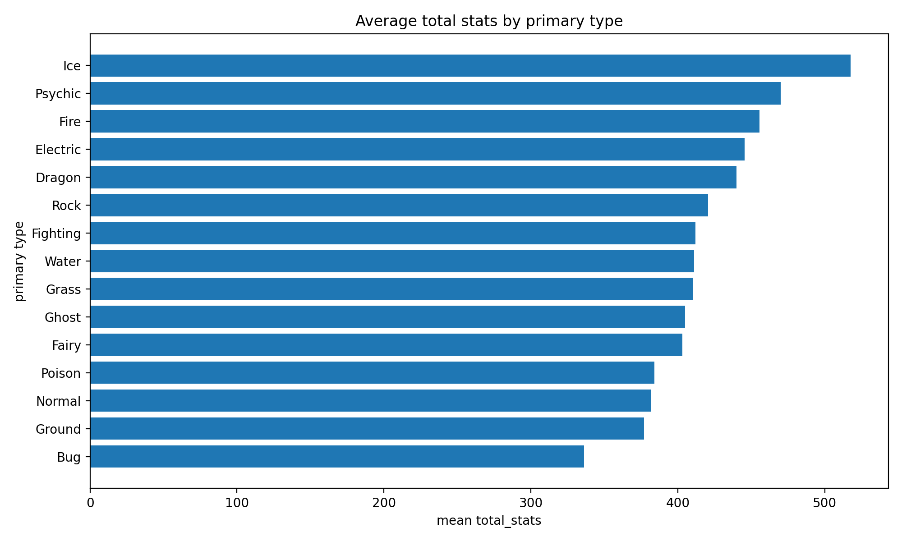
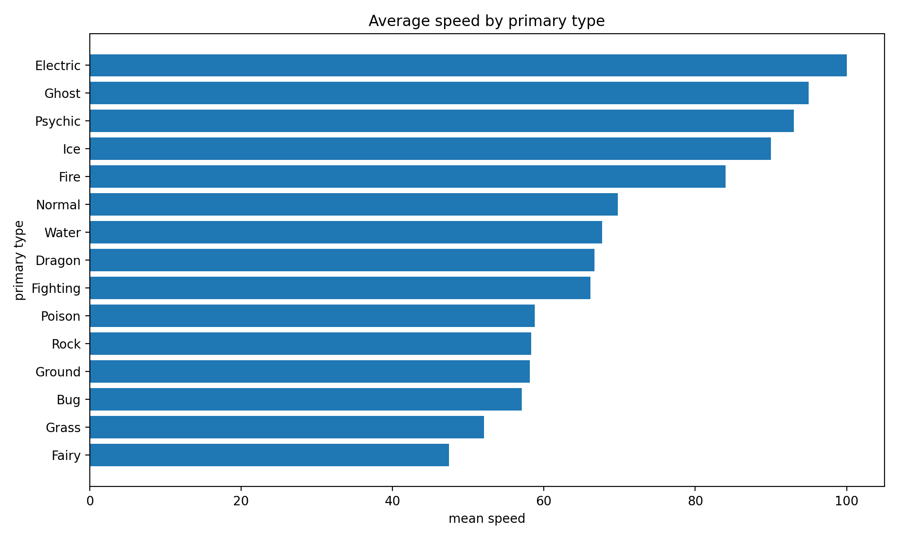
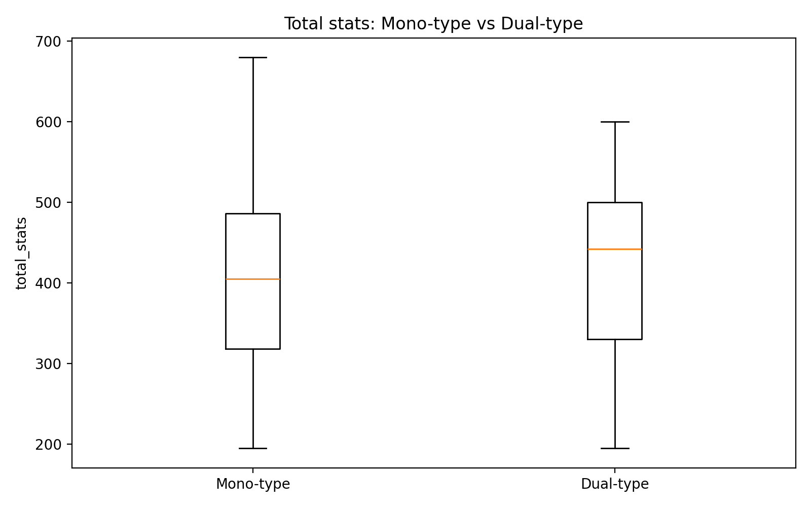
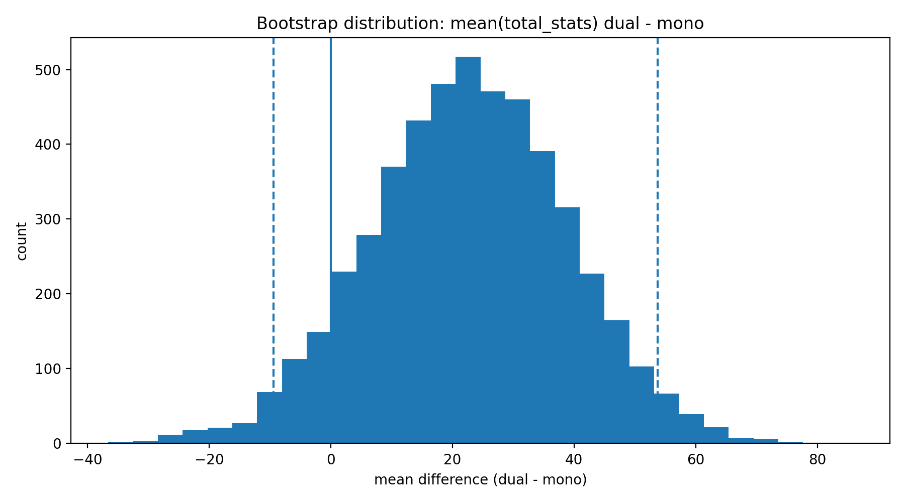
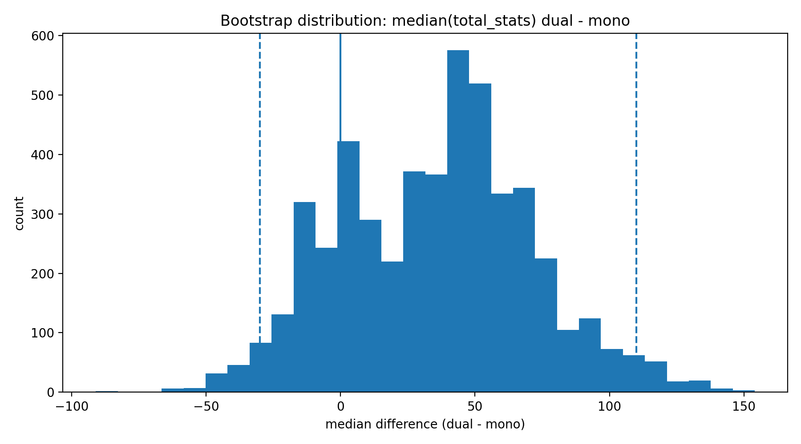

# Pokemon Data Science Report (Gen 1)

## Data source
PokéAPI (`/pokemon/{id}`)

## Pipeline
Fetch raw CSV → clean CSV → EDA plots

## Current outputs
- `data/raw/pokemon_raw.csv`
- `data/processed/pokemon_clean.csv`

## Initial findings

### 1) Distribution of total stats

- A total base stat value around **500** appears very frequently in this dataset.
- Many Pokemon cluster in a mid to high stat range rather than being uniformly distributed.
- There appear to be more lower-stat outliers than very high-stat outliers.

> Note: This interpretation should be validated by checking exact counts, since visual binning in histograms can influence how peaks appear.

### 2) Type occurrences (all types, including dual types)

- **Poison** and **Water** are among the most frequent type occurrences in Gen 1.
- The distribution is uneven: a few types appear very often, while several types are relatively rare.

### 3) Primary types only

- **Water** appears to be the most common primary type in Gen 1.
- Compared to total type occurrences, **Poison** drops significantly, which suggests it often appears as a secondary type.
- **Normal** appears frequently as a primary/mono type and seems less dependent on dual-typing than some other types.

### 4) Top 10 Pokemon by total stats

- This plot highlights the highest-stat Pokemon in the Gen 1 dataset.
- 5 of the top 10 Pokemon are legendary.
- In addition 1 Pokemon is often referred to as a “pseudo-legendary”, meaning more than half of the top 10 are rare/high-tier Pokémon by common fan classification.
- This supports the expectation that the upper end of the `total_stats` distribution is dominated by legendary Pokemon.

### QA checks and summary metrics (plots)

### 5) Mono-type vs Dual-type count

- This plot shows the class balance between mono-type and dual-type Pokémon in the current dataset.
- Mono typing is more common than dual-type

### 6) Missing values per column

- This QA plot helps validate dataset completeness before statistical testing or modeling.
- Everything works fine

### 7) Average total stats by primary type

- This plot compares average `total_stats` across primary Pokémon types.
- **Ice** has the highest `total_stats` by far
- **Bug** has the lowest `total_stats` by far
- Every other type is clustering around 400 `total_stats`

### 8) Average speed by primary type

- This plot compares average `speed` across primary Pokémon types and may reveal type-specific tendencies.

### Hypothesis testing (Mono-type vs Dual-type)

### Question
Do dual-type Pokémon have higher average `total_stats` than mono-type Pokémon?

### Method
- Split Pokémon into two groups using `is_dual_type`
- Compare `total_stats` between groups
- Estimate uncertainty using bootstrap resampling (mean difference = dual - mono)

### 9) Total stats: Mono-type vs Dual-type (boxplot)

- The boxplot provides a visual comparison of the `total_stats` distributions for mono-type and dual-type Pokémon.
- The only noticable difference is that Mono-type has a higher `total_stats` peak compared to dual-type, the rest is very similar

### 10) Bootstrap distribution of mean difference (dual - mono)

- This plot shows the bootstrap distribution of the mean difference in `total_stats` between dual-type and mono-type Pokémon.
- If the 95% confidence interval lies entirely above 0, it supports the hypothesis that dual-type Pokémon have a higher average `total_stats` in this dataset.
- The estimated mean difference (dual - mono) is positive (~22.7), but the bootstrap 95% confidence interval includes 0 ([-9.4, 53.8]). Therefore, this result is inconclusive for this dataset and method

### 10.5) Bootstrap distribution of median difference (dual - mono)

- The median-based bootstrap robustness check also suggests a positive effect (dual - mono median difference ≈ 35.3), but the 95% confidence interval is wide and includes 0 ([-30, 110]). This indicates substantial uncertainty, so the result remains inconclusive.

> Compared to the mean-based bootstrap result, the median-based interval is wider, which suggests the estimated group difference is not very stable in this dataset and may depend on sample composition.

### Output files
- `reports/hypothesis_results.json`

## Notes
- Type occurrences count all type appearances (dual-type Pokemon count twice).
- Primary type counts only the first listed type per Pokemon.
- Differences between the two plots highlight how counting definitions affect interpretation.